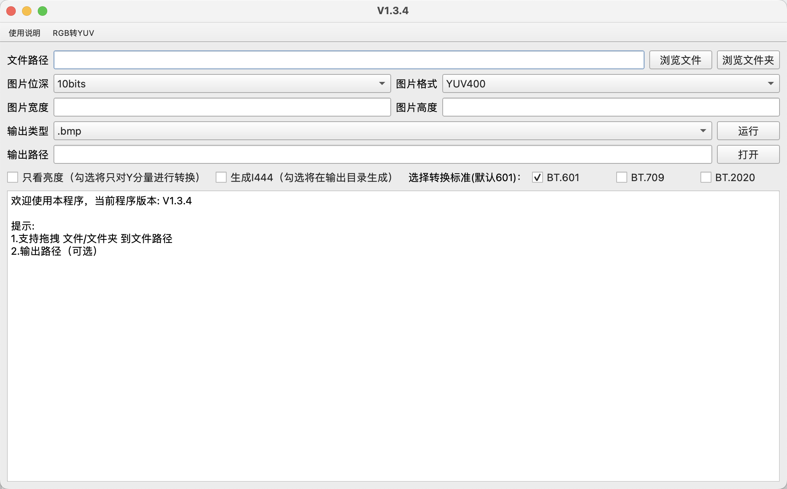
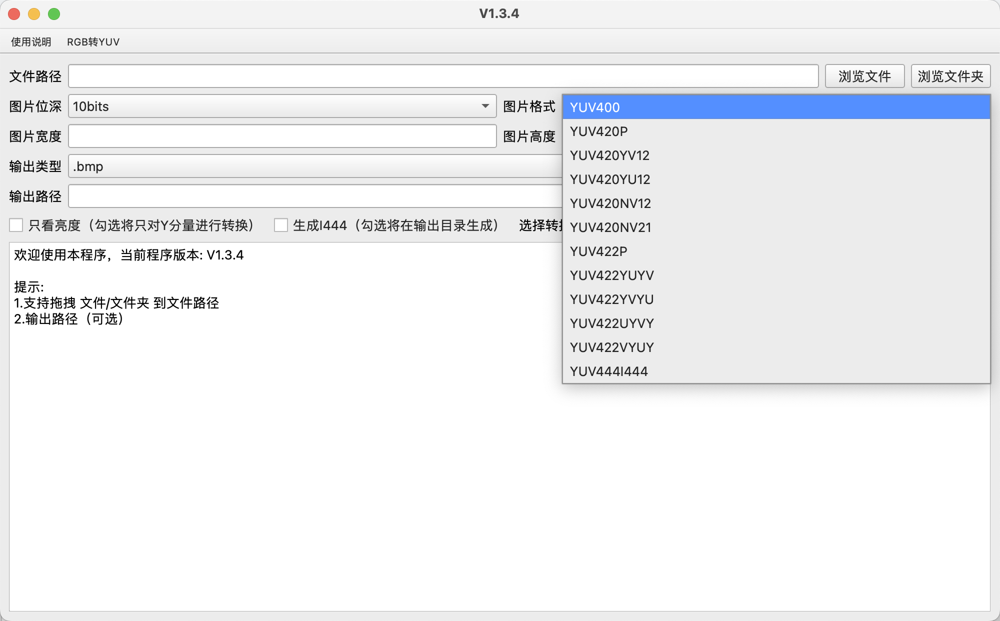
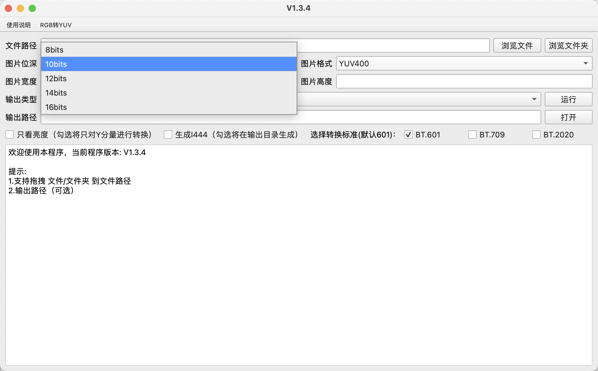

# yuv2rgb
这是一款将YUV格式的图片转换成常见的RGB格式的图片，预置 RGB 类型（bmp，jpg，jpeg，png）

支持图片位深：8，10，12，14，16

支持常见的 YUV 格式（也支持特殊的 YUV400 ）

程序对用户输入做了检查，程序执行时无法再次点击运行按钮，请放心使用

特色功能：
1. 支持 单亮度转换
2. 支持 YUV图片 以 I444 格式再输出
3. 支持 不同转换标准（不同标准色域范围不同，所以请根据实际情况勾选）

# 界面展示

